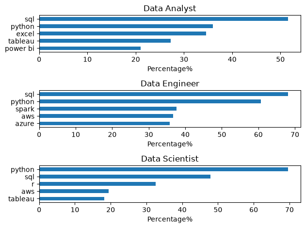

# The Analysis 


## 1. What are most in demand skills for the top 3 most popular data roles in INDIA?

To find the most demanded skills for the top 3 most popular data roles. I filtered out those positions by which ones were the most popular, and got the top 5 skills for these top 3 roles. This query highlights the most popular job titles and their top skills, showing which skills I should pay attention to depending on the role I'm targeting. 

View my notebook with detailed steps here: [2_Skill_Demand.ipynb](Project/2_Skill_Demand.ipynb).

### Visualize Data

```Python

fig, ax = plt.subplots(len(job_titles), 1)

for i, job_title in enumerate(job_titles):
    job_plot = df_skills_count[df_skills_count['job_title_short'] == job_title].head()
    job_plot.plot(kind= 'barh' , x= 'job_skills', y= 'skill_count'  ,ax= ax[i], title = job_title, legend= False)
    ax[i].invert_yaxis()
    fig.tight_layout()
    plt.show()
```


### Results



### Insights

- SQL is the most in-demand skill across all three roles, appearing in over 50% of Data Analyst and nearly 70% of Data Engineer job postings.

- Python is a core skill for both Data Engineers (≈60%) and Data Scientists (≈70%), with strong demand for Data Analysts (≈36%) as well.

- Data Analysts emphasize Excel, Tableau, and Power BI, highlighting the importance of business intelligence and reporting tools.

- Data Engineers require expertise in Spark, AWS, and Azure, reflecting the growing focus on cloud platforms and big data technologies.

- While Python and SQL are foundational across all three careers, each role demands a distinct secondary skill set aligned with its responsibilities.

## 2. How are in-demand skills trending for Data Analysts in INDIA?
To find how skills are trending in 2023 for Data Analysts, I filtered data analyst positions and grouped the skills by the month of the job postings. This got me the top 5 skills of data analysts by month, showing how popular skills were throughout 2023.

View my notebook with detailed steps here: [3_Skills_Trend](Project/3_Skills_Trend.ipynb).


### Visualaize Data
``` python
from matplotlib.ticker import PercentFormatter

df_plot = df_DA_US_percent.iloc[:, :5]
sns.lineplot(data=df_plot, dashes=False, legend='full', palette='tab10')

plt.gca().yaxis.set_major_formatter(PercentFormatter(decimals=0))

plt.show()
```


### Results

  
*Bar graph visualizing the trending top skills for data analysts in INDIA in 2023.*

### Insights:

- SQL remained the most in-demand skill throughout 2023, consistently appearing in about 50–56% of Data Analyst job postings.

- Python demand was stable, averaging 35–40% of postings, making it the second most requested technical skill.

- Excel maintained strong demand across the year, with noticeable peaks around May and October, highlighting its continued importance in analytics roles.

- Power BI and Tableau were less frequently requested than SQL, Python, and Excel, but both showed increased demand during the second half of the year, indicating growing emphasis on data visualization skills.


## 4. What are the most optimal skills to learn for Data Analysts?

To identify the most optimal skills to learn ( the ones that are the highest paid and highest in demand) I calculated the percent of skill demand and the median salary of these skills. To easily identify which are the most optimal skills to learn. 

View my notebook with detailed steps here: [4_Optimal_Skills](Project/4_Optimal_Skills.ipynb).

#### Visualize Data

```python
from adjustText import adjust_text
import matplotlib.pyplot as plt

plt.scatter(df_DA_skills_high_demand['skill_percent'], df_DA_skills_high_demand['median_salary'])
plt.show()

```

#### Results

    
*A scatter plot visualizing the most optimal skills (high paying & high demand) for data analysts in INDIA.*

#### Insights:

- SQL and Python provide the strongest balance of demand and salary, making them the most valuable core skills for aspiring Data Analysts in India.

- Power BI, Tableau, and Spark command the highest median salaries (above $105K) despite appearing in a smaller percentage of job postings, indicating specialized, high-value skills.

- Cloud technologies such as Azure, AWS, and Oracle are less frequently requested for Data Analyst roles and generally offer lower median salaries compared to BI and analytics tools.

### Visualizing Different Techonologies

Let's visualize the different technologies as well in the graph. We'll add color labels based on the technology (e.g., {Programming: Python})

#### Visualize Data

```python
from matplotlib.ticker import PercentFormatter

# Create a scatter plot
scatter = sns.scatterplot(
    data=df_DA_skills_tech_high_demand,
    x='skill_perc',
    y='median',
    hue='technology',  # Color by technology
    palette='bright',  
    legend='full'  # Ensure the legend is shown
)
plt.show()

```

#### Results

  
*A scatter plot visualizing the most optimal skills (high paying & high demand) for data analysts in INDIA with color labels for technology.*

#### Insights:

- The scatter plot shows that most of the `programming` skills (colored blue) tend to cluster at higher salary levels compared to other categories, indicating that programming expertise might offer greater salary benefits within the data analytics field.

- The database skills (colored orange), such as Oracle and SQL Server, are associated with some of the highest salaries among data analyst tools. This indicates a significant demand and valuation for data management and manipulation expertise in the industry.

- Analyst tools (colored green), including Tableau and Power BI, are prevalent in job postings and offer competitive salaries, showing that visualization and data analysis software are crucial for current data roles. This category not only has good salaries but is also versatile across different types of data tasks.

# What I Learned

Throughout this project, I deepened my understanding of the data analyst job market and enhanced my technical skills in Python, especially in data manipulation and visualization. Here are a few specific things I learned:

- **Advanced Python Usage**: Utilizing libraries such as Pandas for data manipulation, Seaborn and Matplotlib for data visualization, and other libraries helped me perform complex data analysis tasks more efficiently.
- **Data Cleaning Importance**: I learned that thorough data cleaning and preparation are crucial before any analysis can be conducted, ensuring the accuracy of insights derived from the data.
- **Strategic Skill Analysis**: The project emphasized the importance of aligning one's skills with market demand. Understanding the relationship between skill demand, salary, and job availability allows for more strategic career planning in the tech industry.


# Insights

This project provided several general insights into the data job market for analysts:

- **Skill Demand and Salary Correlation**: There is a clear correlation between the demand for specific skills and the salaries these skills command. Advanced and specialized skills like Python and Oracle often lead to higher salaries.
- **Market Trends**: There are changing trends in skill demand, highlighting the dynamic nature of the data job market. Keeping up with these trends is essential for career growth in data analytics.
- **Economic Value of Skills**: Understanding which skills are both in-demand and well-compensated can guide data analysts in prioritizing learning to maximize their economic returns.


# Challenges I Faced

This project was not without its challenges, but it provided good learning opportunities:

- **Data Inconsistencies**: Handling missing or inconsistent data entries requires careful consideration and thorough data-cleaning techniques to ensure the integrity of the analysis.
- **Complex Data Visualization**: Designing effective visual representations of complex datasets was challenging but critical for conveying insights clearly and compellingly.
- **Balancing Breadth and Depth**: Deciding how deeply to dive into each analysis while maintaining a broad overview of the data landscape required constant balancing to ensure comprehensive coverage without getting lost in details.


# Conclusion

This exploration into the data analyst job market has been incredibly informative, highlighting the critical skills and trends that shape this evolving field. The insights I got enhance my understanding and provide actionable guidance for anyone looking to advance their career in data analytics. As the market continues to change, ongoing analysis will be essential to stay ahead in data analytics. This project is a good foundation for future explorations and underscores the importance of continuous learning and adaptation in the data field.

